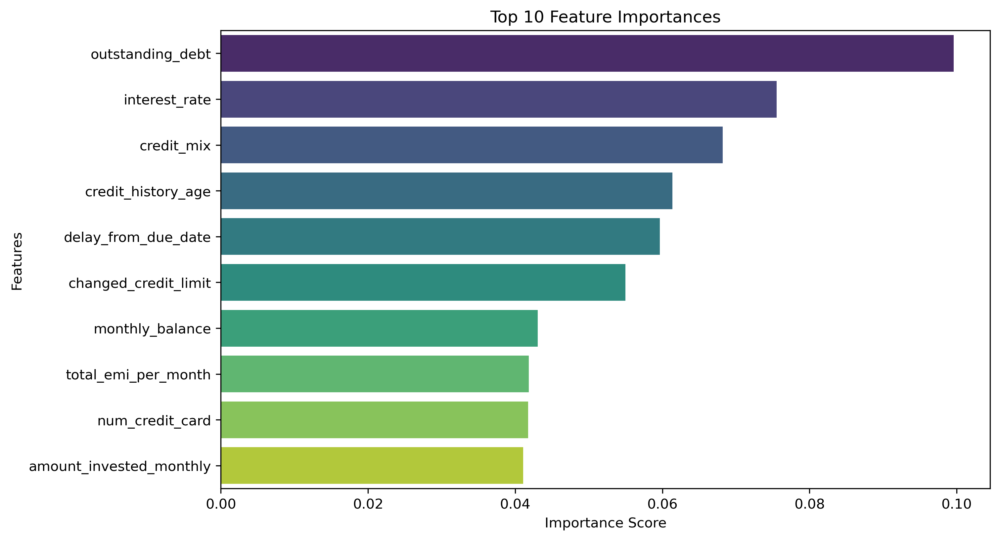
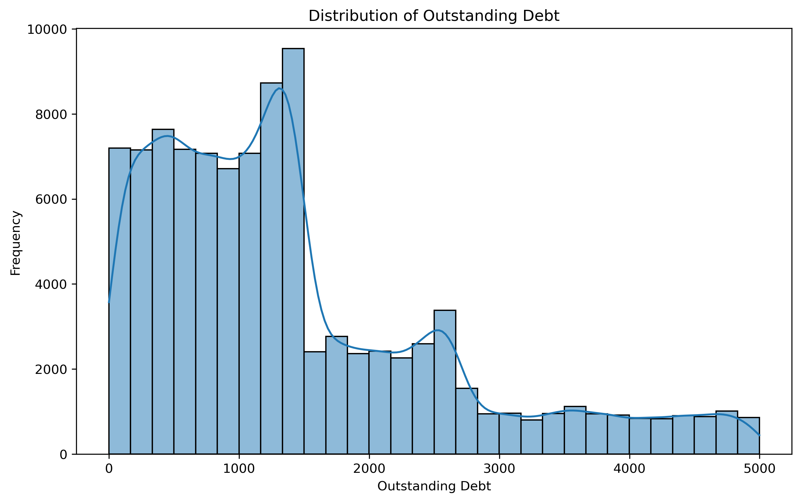
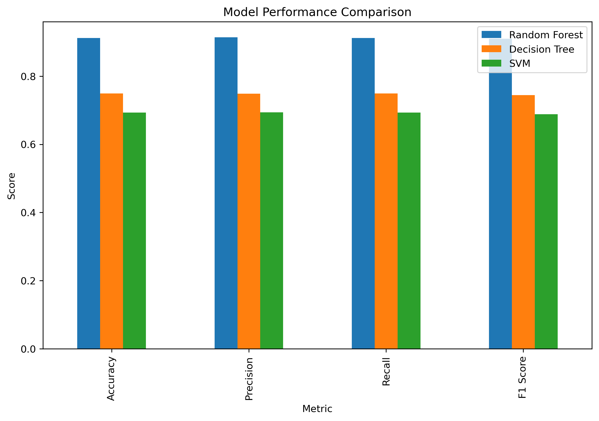
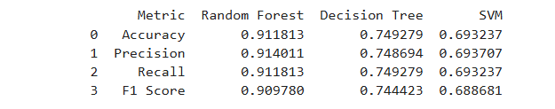
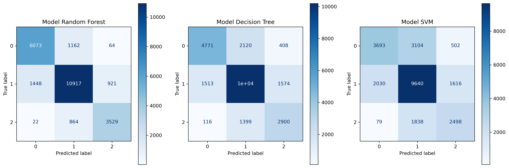
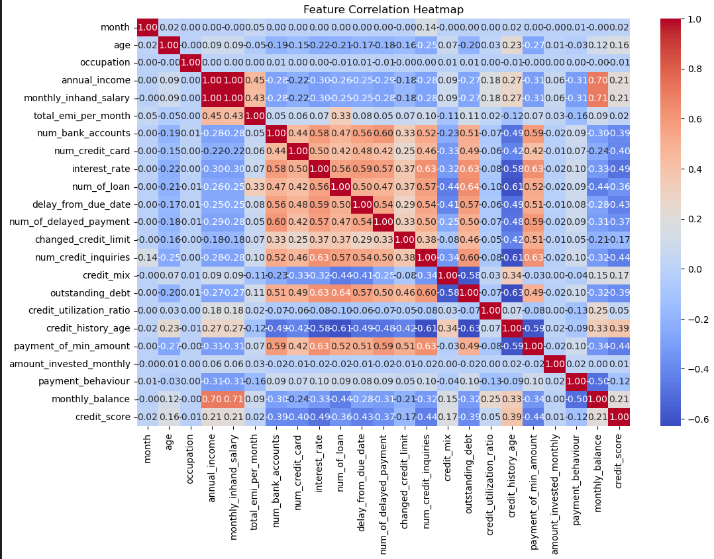

# Team-Project-2
# Creditworthiness and Risk Assessment: Identifying Factors Influencing Credit Worthiness

# Project Proposal: Creditworthiness Classification
## Objective
The aim of our project is to uncover patterns in customer creditworthiness to help predict their likelihood of repaying loans. We’ll examine relationships between factors such as income levels, payment behavior, credit mix, and debt ratios. Our goal is to use these variables to classify customers into categories based on their credit scores—Good, Standard, or Poor—using a machine learning model. This project has the potential to support financial institutions in making data-driven decisions on loan approvals, minimizing risk, and promoting financial accessibility.
The primary objective was to build, evaluate, and compare machine learning models to optimize credit score classification. Through this analysis, we aim to provide insights that can guide financial institutions in credit risk assessment.
## Questions:
1. How do various financial metrics and demographics correlate with credit scores?
2. What are the most influential factors impacting loan approval outcomes?
3. How have creditworthiness trends evolved over time?

## Project Overview
This project examines relationships between several factors affecting credit scores and loan approvals, including income, debt, employment stability, and past credit behavior. By identifying key patterns, we aim to uncover trends and insights into creditworthiness and the risk factors associated with loan defaults.

The project utilizes Python and employs libraries such as Pandas for data manipulation, Matplotlib for data visualization, and Scikit-learn for model analysis.

---

## Data Files
The project uses the following CSV data files located in the `Resources` folder:
1. `credit_score_cleaned_train.csv`: Main Dataset cleanedup
2. `Test.csv`: Raw Test Dataset

---

### Key Functions & Workflow

#### Data Import and Preparation
- **Import Data**: Load datasets using Pandas, focusing on relevant variables like credit score, debt, interest rate, and payment history.
- **Data Cleaning**: Handle missing values, remove irrelevant columns (e.g., `id`, `customer_id`), and encode categorical data for model compatibility.
- **Standardization**: Apply `StandardScaler` to numerical features for consistent scaling across all models.

#### Credit Score Analysis
- **Trend Analysis**: Analyze the distribution of credit scores and key influencing factors (e.g., outstanding debt, interest rates) over time.
- **Feature Analysis**: Compute monthly and annual averages for critical features such as outstanding debt and interest rates to observe trends affecting creditworthiness.

#### Data Merging
- **Merge Datasets**: Integrate datasets on fields like `ClientID` and `Date` to facilitate a holistic view of credit scores, loan status, and relevant financial indicators.

#### Data Visualization
- **Generate Key Visualizations**: Visualizations were created and saved in the `Graphs` folder to capture trends and relationships, including:
  - **Feature Importance**: Highlights which factors (e.g., outstanding debt, interest rate) most influence credit score predictions.
  - **Outstanding Debt Distribution**: Shows the frequency distribution of outstanding debt across the population.
  - **Interest Rates and Credit Score Categories**: Illustrates how interest rates differ based on credit score groups.
  - **Model Performance Comparison**: Displays accuracy, precision, recall, and F1 scores across Random Forest, Decision Tree, and SVM.

#### Correlation Analysis
- **Compute Correlations**: Investigate correlations between credit scores and other factors, revealing insights such as:
  - Positive correlation between low debt and higher credit scores.
  - Negative correlation between high credit utilization and lower credit scores.
  - Trends indicating that higher outstanding debt is linked to decreased creditworthiness.

#### Predictive Analysis
- **Machine Learning Models**: Developed and compared models (Random Forest, Decision Tree, and SVM) to predict creditworthiness and loan approval likelihood based on key features.
- **Model Selection**: Based on evaluation metrics, Random Forest was identified as the optimal model for predicting credit scores with high accuracy and reliability.

## Output
The code produces:
 **Graphs**: Visualizations saved in the `Graphs` folder:
   - Feature Importance
   - Outstanding Debt Distribution
   - Interest Rates and Credit Score Categories
   - Model Performance Comparison
   - Correlation Heatmap of Key Metric and more

## Examples 

# Plot Top 10 Feature Importance and All Features:

Output:   
Output:   
>> Conclusion: This comparison highlights the most influential features driving credit score predictions, with outstanding debt and interest rates appearing as significant predictors.

# Plot Outstanding Debt Distribution:

Output:   
>> Conclusion: The majority of the population has relatively low levels of outstanding debt, while a smaller subset shows higher debt levels, indicating potential credit risk.

# Plot Model Performance Comparison:

Output:   
>> Conclusion: The Random Forest model achieved the highest performance across accuracy, precision, and recall, making it the most reliable model for creditworthiness prediction.

# Plot Credit Scores Across All Models (Tweaked Scores):

Output:   
>> Conclusion: Adjusting model parameters improved the spread of credit scores, refining predictions across different credit score ranges.

# Plot Payment Behavior Analysis:

Output:   
>> Conclusion: This analysis demonstrates a strong correlation between delayed payments and lower credit scores, affirming payment behavior as a critical factor.

# Plot Confusion Matrices for All Models:

Output:   
>> Conclusion: Random Forest shows the least misclassifications, confirming its suitability as the primary model for accurate credit score predictions.

# Plot Correlation Heatmap of Key Metrics:

Output:   
>> Conclusion: Correlations reveal that high debt levels and increased credit utilization negatively impact credit scores, while stable payment behavior and low debt enhance creditworthiness.
